# Frontend Architecture Structure

> **Author:** Kritsana Prasit  
> **Last Updated:** January 24, 2026  
> **Purpose:** Comprehensive guide to the frontend architecture using Next.js 16 App Router with React 19

## Overview

This project uses **Next.js 16 App Router** with **React 19** for the frontend, featuring server and client components, modern UI with shadcn/ui, and type-safe API integration via Eden Treaty.

## Architecture Diagram

```mermaid
graph TB
    subgraph "Next.js App Router"
        A[app/layout.tsx]
        B[app/page.tsx]
        C[app/globals.css]
        
        subgraph "Routes"
            D[app/(admin-dasboard)/]
            E[app/api/]
        end
    end
    
    subgraph "Components Layer"
        F[components/ui/]
        F1[Button]
        F2[Form]
        F3[Input]
        F4[Card]
        F5[Dialog]
        F6[...40+ components]
        
        F --> F1
        F --> F2
        F --> F3
        F --> F4
        F --> F5
        F --> F6
    end
    
    subgraph "State Management"
        G[React Query]
        H[Zustand]
        I[React Hook Form]
    end
    
    subgraph "API Layer"
        J[eden/treaty.ts]
        K[Elysia Backend]
    end
    
    subgraph "Styling"
        L[TailwindCSS 4]
        M[Framer Motion]
        N[tw-animate-css]
    end
    
    subgraph "Hooks"
        O[hooks/use-mobile.ts]
    end
    
    subgraph "Utils"
        P[lib/utils.ts]
    end
    
    A --> B
    A --> C
    A --> D
    B --> F
    F --> I
    F --> G
    B --> J
    J --> K
    F --> L
    F --> M
    B --> O
    F --> P
    
    style A fill:#0ea5e9
    style F fill:#8b5cf6
    style G fill:#ec4899
    style J fill:#f59e0b
    style L fill:#10b981
```

## Directory Structure

```
app/
├── layout.tsx                 # Root layout with fonts & metadata
├── page.tsx                   # Home page
├── globals.css               # Global styles & Tailwind imports
├── (admin-dasboard)/         # Route group for admin
│   ├── layout.tsx            # Admin layout
│   └── admin-dasboard/
│       └── index.tsx         # Admin dashboard page
├── api/                      # API route handlers
│   └── [[...slugs]]/
│       └── route.ts          # Catch-all for Elysia
└── lib/                      # App-specific utilities

components/
└── ui/                       # shadcn/ui components (40+)
    ├── button.tsx
    ├── form.tsx
    ├── input.tsx
    ├── card.tsx
    ├── dialog.tsx
    └── ...

eden/
└── treaty.ts                 # Type-safe API client

hooks/
└── use-mobile.ts             # Mobile detection hook

lib/
└── utils.ts                  # Utility functions (cn, etc.)
```

## Component Architecture

```mermaid
graph LR
    subgraph "Page Component"
        A[page.tsx]
    end
    
    subgraph "Feature Components"
        B[ProductList]
        C[ProductCard]
        D[CartSummary]
    end
    
    subgraph "UI Components"
        E[Button]
        F[Card]
        G[Badge]
        H[Dialog]
    end
    
    subgraph "Hooks"
        I[useProducts]
        J[useCart]
        K[useMobile]
    end
    
    subgraph "API Client"
        L[treaty client]
        M[React Query]
    end
    
    A --> B
    A --> D
    B --> C
    C --> E
    C --> F
    C --> G
    D --> H
    
    B --> I
    D --> J
    C --> K
    
    I --> M
    J --> M
    M --> L
    
    style A fill:#0ea5e9
    style B fill:#8b5cf6
    style E fill:#ec4899
    style I fill:#f59e0b
    style L fill:#10b981
```



## Layer Responsibilities

### 1. **App Router Layer** (`app/`)

#### Root Layout (`app/layout.tsx`)
```tsx
import type { Metadata } from "next";
import { Geist, Geist_Mono } from "next/font/google";
import "./globals.css";

const geistSans = Geist({
  variable: "--font-geist-sans",
  subsets: ["latin"],
});

const geistMono = Geist_Mono({
  variable: "--font-geist-mono",
  subsets: ["latin"],
});

export const metadata: Metadata = {
  title: "Sanaeva Store",
  description: "E-commerce platform built with Next.js",
};

export default function RootLayout({
  children,
}: Readonly<{
  children: React.ReactNode;
}>) {
  return (
    <html lang="en">
      <body className={`${geistSans.variable} ${geistMono.variable} antialiased`}>
        {children}
      </body>
    </html>
  );
}
```

**Responsibilities:**
- Define global HTML structure
- Load fonts and global styles
- Set metadata for SEO
- Provide context providers (when needed)

#### Page Component (`app/page.tsx`)
```tsx
import { Button } from "@/components/ui/button";

export default function Home() {
  return (
    <div className="flex min-h-screen items-center justify-center bg-zinc-50 font-sans dark:bg-black">
      <main className="flex min-h-screen w-full max-w-3xl flex-col items-center justify-between py-32 px-16 bg-white dark:bg-black sm:items-start">
        <h1 className="text-xl font-extrabold text-zinc-900 dark:text-white sm:text-3xl">
          Welcome to <span className="text-blue-600">Sanaeva Store</span>
        </h1>
        <Button size={"lg"}>Shop Now</Button>
      </main>
    </div>
  );
}
```

**Responsibilities:**
- Define page content
- Compose feature components
- Handle page-level data fetching (Server Components)
- Define page metadata

---

### 2. **Route Groups** (`app/(group-name)/`)

Route groups allow organizing routes without affecting the URL.

```
app/
├── (admin-dasboard)/         # Admin routes
│   ├── layout.tsx            # Admin-specific layout
│   └── admin-dasboard/
│       └── index.tsx
├── (auth)/                   # Auth routes (example)
│   ├── login/
│   └── register/
└── (shop)/                   # Shop routes (example)
    ├── products/
    └── cart/
```

**Benefits:**
- Organize related routes
- Apply different layouts per group
- Keep URLs clean

---

### 3. **Component Layer** (`components/`)

#### UI Components (`components/ui/`)

Built with **shadcn/ui** - a collection of re-usable, accessible components:

**Available Components:**
- **Form Controls:** Button, Input, Textarea, Checkbox, Radio, Select, Switch
- **Layout:** Card, Separator, Tabs, Accordion, Collapsible, Sheet, Sidebar
- **Feedback:** Alert, Toast (Sonner), Progress, Spinner, Skeleton
- **Overlay:** Dialog, Drawer, Popover, Tooltip, Hover Card
- **Navigation:** Breadcrumb, Navigation Menu, Menubar, Pagination
- **Data Display:** Table, Badge, Avatar, Empty, Calendar
- **Advanced:** Command, Context Menu, Dropdown Menu, Resizable

**Example Component:**
```tsx
// components/ui/button.tsx
import { cn } from "@/lib/utils"
import { cva, type VariantProps } from "class-variance-authority"

const buttonVariants = cva(
  "inline-flex items-center justify-center rounded-md text-sm font-medium",
  {
    variants: {
      variant: {
        default: "bg-primary text-primary-foreground hover:bg-primary/90",
        destructive: "bg-destructive text-destructive-foreground",
        outline: "border border-input hover:bg-accent",
        ghost: "hover:bg-accent hover:text-accent-foreground",
      },
      size: {
        default: "h-10 px-4 py-2",
        sm: "h-9 px-3",
        lg: "h-11 px-8",
      },
    },
    defaultVariants: {
      variant: "default",
      size: "default",
    },
  }
)

export function Button({ className, variant, size, ...props }) {
  return (
    <button
      className={cn(buttonVariants({ variant, size, className }))}
      {...props}
    />
  )
}
```

**Features:**
- ✅ Fully typed with TypeScript
- ✅ Accessible (ARIA compliant)
- ✅ Customizable with variants
- ✅ Built on Radix UI primitives
- ✅ Styled with TailwindCSS

---

### 4. **State Management**

#### React Query (`@tanstack/react-query`)

For server state management:

```tsx
// hooks/use-products.ts
import { useQuery } from '@tanstack/react-query'
import { client } from '@/eden/treaty'

export function useProducts() {
  return useQuery({
    queryKey: ['products'],
    queryFn: async () => {
      const { data } = await client.api.products.get()
      return data
    }
  })
}

// Usage in component
function ProductList() {
  const { data: products, isLoading, error } = useProducts()
  
  if (isLoading) return <Spinner />
  if (error) return <Alert>Error loading products</Alert>
  
  return (
    <div className="grid grid-cols-3 gap-4">
      {products?.map(product => (
        <ProductCard key={product.id} product={product} />
      ))}
    </div>
  )
}
```

#### Zustand

For client state management:

```tsx
// stores/cart-store.ts
import { create } from 'zustand'

interface CartStore {
  items: CartItem[]
  addItem: (item: CartItem) => void
  removeItem: (id: string) => void
  clearCart: () => void
}

export const useCartStore = create<CartStore>((set) => ({
  items: [],
  addItem: (item) => set((state) => ({ 
    items: [...state.items, item] 
  })),
  removeItem: (id) => set((state) => ({ 
    items: state.items.filter(i => i.id !== id) 
  })),
  clearCart: () => set({ items: [] })
}))

// Usage
function Cart() {
  const { items, removeItem } = useCartStore()
  
  return (
    <div>
      {items.map(item => (
        <div key={item.id}>
          {item.name}
          <Button onClick={() => removeItem(item.id)}>Remove</Button>
        </div>
      ))}
    </div>
  )
}
```

#### React Hook Form + Zod

For form state and validation:

```tsx
import { useForm } from 'react-hook-form'
import { zodResolver } from '@hookform/resolvers/zod'
import { z } from 'zod'

const loginSchema = z.object({
  email: z.string().email('Invalid email'),
  password: z.string().min(8, 'Password must be at least 8 characters')
})

type LoginForm = z.infer<typeof loginSchema>

function LoginForm() {
  const form = useForm<LoginForm>({
    resolver: zodResolver(loginSchema),
    defaultValues: {
      email: '',
      password: ''
    }
  })
  
  const onSubmit = async (data: LoginForm) => {
    // API call
  }
  
  return (
    <form onSubmit={form.handleSubmit(onSubmit)}>
      <Input {...form.register('email')} />
      {form.formState.errors.email && (
        <p className="text-red-500">{form.formState.errors.email.message}</p>
      )}
      
      <Input type="password" {...form.register('password')} />
      {form.formState.errors.password && (
        <p className="text-red-500">{form.formState.errors.password.message}</p>
      )}
      
      <Button type="submit" disabled={form.formState.isSubmitting}>
        Login
      </Button>
    </form>
  )
}
```

---

### 5. **API Integration Layer** (`eden/`)

#### Eden Treaty Client

Type-safe API client for Elysia backend:

```typescript
// eden/treaty.ts
import { treaty } from '@elysiajs/eden'
import { api } from '@/server/server'

export const client = treaty(api)
```

**Usage:**
```typescript
// Fully typed API calls
const response = await client.api.products.get()
//    ^? { data: Product[], error: null } | { data: null, error: Error }

const created = await client.api.products.post({
  name: "Product",
  price: 100
})
//    ^? { data: Product, error: null } | { data: null, error: Error }
```

**Benefits:**
- ✅ End-to-end type safety
- ✅ Auto-completion in IDE
- ✅ Runtime validation
- ✅ Error handling
- ✅ No code generation needed

---

### 6. **Styling Layer**

#### TailwindCSS 4

Modern utility-first CSS framework:

```tsx
<div className="flex items-center justify-between p-4 bg-white dark:bg-zinc-900 rounded-lg shadow-sm hover:shadow-md transition-shadow">
  <h2 className="text-xl font-bold text-zinc-900 dark:text-white">
    Product Name
  </h2>
  <Badge variant="success">In Stock</Badge>
</div>
```

#### Utility Function (`lib/utils.ts`)

```typescript
import { clsx, type ClassValue } from "clsx"
import { twMerge } from "tailwind-merge"

export function cn(...inputs: ClassValue[]) {
  return twMerge(clsx(inputs))
}
```

**Usage:**
```tsx
<Button className={cn(
  "text-lg",
  isActive && "bg-blue-500",
  isDisabled && "opacity-50 cursor-not-allowed"
)}>
  Click me
</Button>
```

#### Framer Motion

For animations:

```tsx
import { motion } from 'framer-motion'

function AnimatedCard() {
  return (
    <motion.div
      initial={{ opacity: 0, y: 20 }}
      animate={{ opacity: 1, y: 0 }}
      exit={{ opacity: 0, y: -20 }}
      transition={{ duration: 0.3 }}
    >
      <Card>Content</Card>
    </motion.div>
  )
}
```

---

### 7. **Hooks Layer** (`hooks/`)

Custom React hooks for reusable logic:

```typescript
// hooks/use-mobile.ts
import { useEffect, useState } from 'react'

export function useMobile(breakpoint = 768) {
  const [isMobile, setIsMobile] = useState(false)

  useEffect(() => {
    const checkMobile = () => {
      setIsMobile(window.innerWidth < breakpoint)
    }

    checkMobile()
    window.addEventListener('resize', checkMobile)
    return () => window.removeEventListener('resize', checkMobile)
  }, [breakpoint])

  return isMobile
}

// Usage
function ResponsiveNav() {
  const isMobile = useMobile()
  
  return isMobile ? <MobileNav /> : <DesktopNav />
}
```

**Common Hooks:**
- `use-mobile` - Responsive breakpoint detection
- `use-toast` - Toast notifications
- `use-debounce` - Debounced values
- `use-local-storage` - Persistent state

---

## Data Flow Patterns

### Server Component Pattern

```tsx
// app/products/page.tsx (Server Component)
import { prisma } from '@/server/db/client'
import { ProductCard } from '@/components/product-card'

export default async function ProductsPage() {
  // Fetch data on the server
  const products = await prisma.product.findMany()
  
  return (
    <div className="grid grid-cols-3 gap-4">
      {products.map(product => (
        <ProductCard key={product.id} product={product} />
      ))}
    </div>
  )
}
```

**Benefits:**
- ✅ Zero client-side JavaScript for data fetching
- ✅ Direct database access
- ✅ SEO friendly
- ✅ Fast initial load

### Client Component Pattern

```tsx
'use client'

import { useState } from 'react'
import { Button } from '@/components/ui/button'
import { client } from '@/eden/treaty'

export function AddToCartButton({ productId }) {
  const [isLoading, setIsLoading] = useState(false)
  
  const handleClick = async () => {
    setIsLoading(true)
    await client.api.cart.post({ productId })
    setIsLoading(false)
  }
  
  return (
    <Button onClick={handleClick} disabled={isLoading}>
      {isLoading ? 'Adding...' : 'Add to Cart'}
    </Button>
  )
}
```

**Use Cases:**
- Event handlers (onClick, onChange)
- Browser APIs (localStorage, window)
- React hooks (useState, useEffect)
- Real-time features

---

## Form Patterns

### shadcn/ui Form Component

```tsx
'use client'

import { useForm } from 'react-hook-form'
import { zodResolver } from '@hookform/resolvers/zod'
import { z } from 'zod'
import {
  Form,
  FormControl,
  FormField,
  FormItem,
  FormLabel,
  FormMessage,
} from '@/components/ui/form'
import { Input } from '@/components/ui/input'
import { Button } from '@/components/ui/button'

const productSchema = z.object({
  name: z.string().min(3, 'Name must be at least 3 characters'),
  price: z.number().positive('Price must be positive'),
  description: z.string().optional()
})

export function ProductForm() {
  const form = useForm({
    resolver: zodResolver(productSchema),
    defaultValues: {
      name: '',
      price: 0,
      description: ''
    }
  })
  
  const onSubmit = async (data) => {
    await client.api.products.post(data)
  }
  
  return (
    <Form {...form}>
      <form onSubmit={form.handleSubmit(onSubmit)} className="space-y-4">
        <FormField
          control={form.control}
          name="name"
          render={({ field }) => (
            <FormItem>
              <FormLabel>Product Name</FormLabel>
              <FormControl>
                <Input placeholder="Enter product name" {...field} />
              </FormControl>
              <FormMessage />
            </FormItem>
          )}
        />
        
        <FormField
          control={form.control}
          name="price"
          render={({ field }) => (
            <FormItem>
              <FormLabel>Price</FormLabel>
              <FormControl>
                <Input type="number" {...field} />
              </FormControl>
              <FormMessage />
            </FormItem>
          )}
        />
        
        <Button type="submit" disabled={form.formState.isSubmitting}>
          {form.formState.isSubmitting ? 'Creating...' : 'Create Product'}
        </Button>
      </form>
    </Form>
  )
}
```

---

## Styling Patterns

### Component Variants with CVA

```tsx
import { cva, type VariantProps } from 'class-variance-authority'
import { cn } from '@/lib/utils'

const cardVariants = cva(
  "rounded-lg border bg-card text-card-foreground shadow-sm",
  {
    variants: {
      variant: {
        default: "bg-white dark:bg-zinc-900",
        ghost: "border-transparent shadow-none",
        outline: "border-2"
      },
      size: {
        sm: "p-4",
        md: "p-6",
        lg: "p-8"
      }
    },
    defaultVariants: {
      variant: "default",
      size: "md"
    }
  }
)

interface CardProps 
  extends React.HTMLAttributes<HTMLDivElement>,
    VariantProps<typeof cardVariants> {}

export function Card({ className, variant, size, ...props }: CardProps) {
  return (
    <div 
      className={cn(cardVariants({ variant, size }), className)}
      {...props}
    />
  )
}

// Usage
<Card variant="outline" size="lg" className="hover:shadow-lg">
  Content
</Card>
```

### Dark Mode Support

```tsx
// Automatic with next-themes
import { ThemeProvider } from 'next-themes'

export function Providers({ children }) {
  return (
    <ThemeProvider attribute="class" defaultTheme="system" enableSystem>
      {children}
    </ThemeProvider>
  )
}

// CSS with dark: prefix
<div className="bg-white dark:bg-zinc-900 text-zinc-900 dark:text-white">
  Content adapts to theme
</div>
```

---

## Performance Optimization

### Code Splitting

```tsx
// Lazy load heavy components
import dynamic from 'next/dynamic'

const HeavyChart = dynamic(() => import('@/components/heavy-chart'), {
  loading: () => <Skeleton className="h-[400px]" />,
  ssr: false // Disable SSR for client-only components
})
```

### Image Optimization

```tsx
import Image from 'next/image'

<Image
  src="/product.jpg"
  alt="Product"
  width={400}
  height={300}
  className="rounded-lg"
  placeholder="blur"
  blurDataURL="data:image/jpeg;base64,..."
/>
```

### Font Optimization

```tsx
// Automatic with next/font
import { Inter } from 'next/font/google'

const inter = Inter({ 
  subsets: ['latin'],
  display: 'swap', // Prevent FOUT
  variable: '--font-inter'
})
```

---

## Best Practices

### 1. **Server vs Client Components**
- Default to Server Components
- Use 'use client' only when necessary
- Keep interactive logic in Client Components
- Fetch data in Server Components when possible

### 2. **Component Organization**
```
components/
├── ui/              # Reusable UI primitives
├── features/        # Feature-specific components
│   ├── products/
│   ├── cart/
│   └── auth/
└── layouts/         # Layout components
```

### 3. **Type Safety**
- Define prop types with TypeScript
- Use Zod for runtime validation
- Infer types from schemas
- Use Eden Treaty for API calls

### 4. **Accessibility**
- Use semantic HTML
- Add ARIA labels
- Keyboard navigation support
- Test with screen readers
- Use shadcn/ui components (built on Radix UI)

### 5. **Error Handling**
```tsx
// Error boundary
// app/error.tsx
'use client'

export default function Error({ error, reset }) {
  return (
    <div className="flex flex-col items-center justify-center min-h-screen">
      <Alert variant="destructive">
        <AlertTitle>Something went wrong!</AlertTitle>
        <AlertDescription>{error.message}</AlertDescription>
      </Alert>
      <Button onClick={reset} className="mt-4">
        Try again
      </Button>
    </div>
  )
}
```

### 6. **Loading States**
```tsx
// app/products/loading.tsx
export default function Loading() {
  return (
    <div className="grid grid-cols-3 gap-4">
      {[1, 2, 3, 4, 5, 6].map(i => (
        <Skeleton key={i} className="h-[300px]" />
      ))}
    </div>
  )
}
```

---

## Testing Strategy

### Unit Tests
```typescript
import { render, screen } from '@testing-library/react'
import { Button } from '@/components/ui/button'

describe('Button', () => {
  it('renders correctly', () => {
    render(<Button>Click me</Button>)
    expect(screen.getByText('Click me')).toBeInTheDocument()
  })
  
  it('handles click events', () => {
    const onClick = jest.fn()
    render(<Button onClick={onClick}>Click me</Button>)
    screen.getByText('Click me').click()
    expect(onClick).toHaveBeenCalled()
  })
})
```

### Integration Tests
```typescript
import { renderHook, waitFor } from '@testing-library/react'
import { useProducts } from '@/hooks/use-products'

describe('useProducts', () => {
  it('fetches products', async () => {
    const { result } = renderHook(() => useProducts())
    
    await waitFor(() => {
      expect(result.current.isSuccess).toBe(true)
    })
    
    expect(result.current.data).toHaveLength(10)
  })
})
```

---

## Deployment Checklist

- [ ] Environment variables configured
- [ ] Build successful (`bun run build`)
- [ ] No TypeScript errors
- [ ] No ESLint warnings
- [ ] Images optimized
- [ ] Fonts loaded correctly
- [ ] Dark mode working
- [ ] Mobile responsive
- [ ] Accessibility tested
- [ ] Performance metrics checked

---

## Useful Commands

```bash
# Development
bun run dev

# Build
bun run build

# Start production
bun run start

# Lint
bun run lint

# Add shadcn component
bunx shadcn@latest add button
```

---

## Resources

- [Next.js Docs](https://nextjs.org/docs)
- [shadcn/ui](https://ui.shadcn.com)
- [React Query](https://tanstack.com/query)
- [Zustand](https://zustand-demo.pmnd.rs)
- [Framer Motion](https://www.framer.com/motion)
- [TailwindCSS](https://tailwindcss.com)

---

*Generated by AI as directed by Kritsana Prasit on January 24, 2026*
