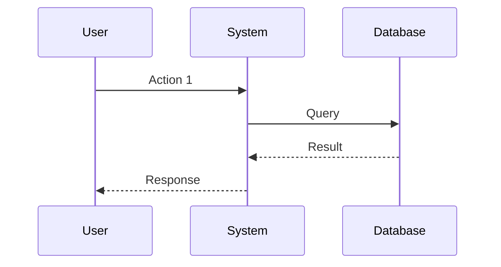

# [Feature Name] Specification

**Status**: 📋 `[TODO | WIP | DONE | DEPRECATED]`
**Priority**: `[High | Medium | Low]`
**Owner**: `[Team Member]`
**Last Updated**: 2026-01-26

## 📋 Overview

Brief description of the feature and its purpose in the system.

## 🎯 Goals

- [ ] Goal 1
- [ ] Goal 2
- [ ] Goal 3

## 📐 Requirements

### Functional Requirements

1. **FR-1**: [Description]
   - Acceptance criteria: [Details]
   - Priority: `[High | Medium | Low]`

2. **FR-2**: [Description]
   - Acceptance criteria: [Details]
   - Priority: `[High | Medium | Low]`

### Non-Functional Requirements

1. **Performance**: [Response time requirements]
2. **Security**: [Security considerations]
3. **Accessibility**: [WCAG compliance requirements]

## 🔄 User Flow



## 🏗️ Technical Design

### API Endpoints

| Method | Endpoint | Description | Auth |
|--------|-----------|-------------|-------|
| GET | `/api/resource` | Get all resources | ✅ |
| POST | `/api/resource` | Create resource | ✅ |
| PUT | `/api/resource/:id` | Update resource | ✅ |
| DELETE | `/api/resource/:id` | Delete resource | ✅ |

### Data Model

```typescript
interface ResourceType {
  id: string
  field1: string
  field2: number
  createdAt: Date
  updatedAt: Date
}
```

### UI Components

- `ComponentName1` - Description
- `ComponentName2` - Description
- `ComponentName3` - Description

## 🧪 Testing

### Unit Tests

- [ ] Test case 1
- [ ] Test case 2
- [ ] Test case 3

### Integration Tests

- [ ] Test scenario 1
- [ ] Test scenario 2

### E2E Tests

- [ ] User flow 1
- [ ] User flow 2

## ✅ Acceptance Criteria

- [ ] AC-1: [Description]
- [ ] AC-2: [Description]
- [ ] AC-3: [Description]

## 📚 References

- [Related Spec 1](link)
- [Related Spec 2](link)
- [Design File](link)

## 📝 Notes

Any additional notes, considerations, or constraints.
