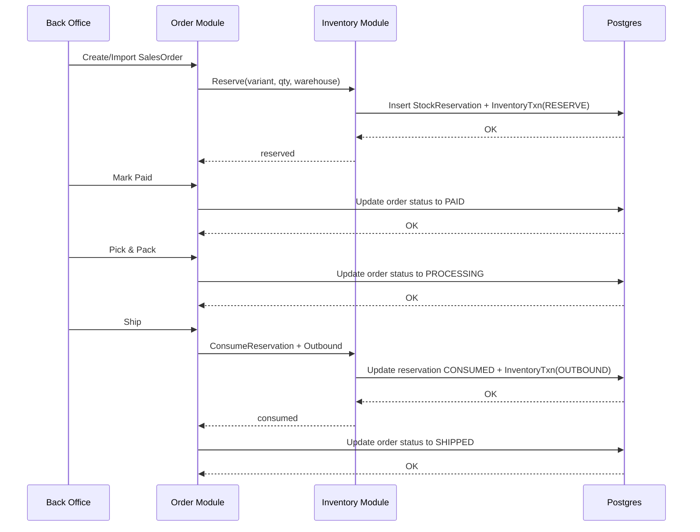
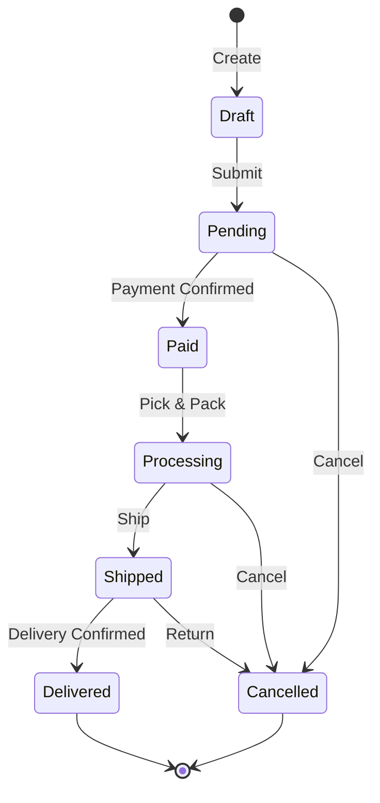

# Order Flow Specification

**Status**: 🔄 WIP
**Priority**: High
**Last Updated**: 2026-01-26

## 📋 Overview

This document describes the order management flow in the admin dashboard, from order creation through fulfillment and shipping. The order system integrates inventory management, payment processing, and tracking.

## 🎯 Goals

- Provide real-time order status tracking
- Ensure accurate inventory reservation and consumption
- Enable efficient order processing and fulfillment
- Maintain comprehensive order audit trail

## 📐 Requirements

### Functional Requirements

1. **FR-1**: Order Creation and Import
   - Manual order creation from admin
   - Import orders from external sources
   - Automatic inventory reservation
   - Acceptance criteria: Stock reserved immediately on order creation
   - Priority: High

2. **FR-2**: Order Status Management
   - Status: Draft, Pending, Paid, Processing, Shipped, Delivered, Cancelled
   - Status transitions with validation
   - Acceptance criteria: Only valid status transitions allowed
   - Priority: High

3. **FR-3**: Payment Processing
   - Mark orders as paid
   - Record payment transactions
   - Handle payment failures
   - Acceptance criteria: Only paid orders can be shipped
   - Priority: High

4. **FR-4**: Inventory Integration
   - Reserve stock on order creation
   - Consume inventory on shipping
   - Release reservation on cancellation
   - Acceptance criteria: Inventory always synchronized with order status
   - Priority: High

## 🔄 Order Flow



### Order Status States



## 🏗️ Technical Design

### Data Models

```typescript
interface SalesOrder {
  id: string
  orderNumber: string
  customerId?: string
  status: OrderStatus
  subtotal: number
  tax: number
  total: number
  currency: string
  notes?: string
  createdAt: Date
  updatedAt: Date
}

enum OrderStatus {
  DRAFT = 'DRAFT'
  PENDING = 'PENDING'
  PAID = 'PAID'
  PROCESSING = 'PROCESSING'
  SHIPPED = 'SHIPPED'
  DELIVERED = 'DELIVERED'
  CANCELLED = 'CANCELLED'
}

interface OrderItem {
  id: string
  orderId: string
  productId: string
  variantId: string
  quantity: number
  unitPrice: number
  totalPrice: number
}

interface StockReservation {
  id: string
  orderId: string
  variantId: string
  quantity: number
  status: ReservationStatus
  createdAt: Date
  updatedAt: Date
}

enum ReservationStatus {
  RESERVED = 'RESERVED'
  CONSUMED = 'CONSUMED'
  RELEASED = 'RELEASED'
}

interface InventoryTxn {
  id: string
  variantId: string
  type: TxnType
  quantity: number
  referenceId?: string
  createdAt: Date
}

enum TxnType {
  RESERVE = 'RESERVE'
  RELEASE = 'RELEASE'
  OUTBOUND = 'OUTBOUND'
  INBOUND = 'INBOUND'
}
```

### API Endpoints

| Method | Endpoint | Description | Auth |
|--------|-----------|-------------|-------|
| GET | `/api/admin/orders` | List orders with filters | ✅ |
| GET | `/api/admin/orders/:id` | Get order details | ✅ |
| POST | `/api/admin/orders` | Create order | ✅ |
| PUT | `/api/admin/orders/:id` | Update order | ✅ |
| DELETE | `/api/admin/orders/:id` | Cancel order | ✅ |
| POST | `/api/admin/orders/:id/pay` | Mark as paid | ✅ |
| POST | `/api/admin/orders/:id/ship` | Ship order | ✅ |
| POST | `/api/admin/orders/import` | Import orders | ✅ |

## 🔒 Security & Validation

### Validation Rules
- Order items cannot be empty
- Quantities must be positive integers
- Customer details required for non-draft orders
- Only valid status transitions allowed

### Audit Trail
- Log all status changes
- Track user who made changes
- Record timestamps for all actions
- Maintain change history

## 🧪 Testing

### Unit Tests
- [ ] Order creation logic
- [ ] Status transition validation
- [ ] Inventory reservation logic
- [ ] Tax calculation

### Integration Tests
- [ ] Order creation with inventory check
- [ ] Payment processing workflow
- [ ] Shipping with inventory consumption
- [ ] Order cancellation and release

### E2E Tests
- [ ] Complete order flow from creation to shipping
- [ ] Bulk import of orders
- [ ] Concurrent order processing
- [ ] Error handling and rollback

## ✅ Acceptance Criteria

- [ ] AC-1: Orders can be created manually
- [ ] AC-2: Orders can be imported from CSV/JSON
- [ ] AC-3: Inventory is reserved on order creation
- [ ] AC-4: Only valid status transitions are allowed
- [ ] AC-5: Orders can only be shipped after payment
- [ ] AC-6: Inventory is consumed on shipping
- [ ] AC-7: All order actions are logged
- [ ] AC-8: Cancelled orders release inventory

## 📝 Implementation Notes

### Current Status
- ✅ Order flow documented
- ✅ Inventory integration designed
- ⏳ Order management UI not implemented
- ⏳ Payment integration pending
- ⏳ Shipping provider integration pending

### Technical Decisions
- Inventory reservation pattern to prevent overselling
- Event-driven architecture for order state changes
- Database transactions for data consistency
- Async processing for external integrations

### Future Enhancements
- Automated fulfillment workflow
- Integration with shipping providers
- Real-time tracking updates
- Multi-warehouse inventory management
- Return and refund processing

## 📚 References

- [Data Model](./data-model.md)
- [Overview](./overview.md)
- [Dashboard Features](../features/overview.md)
- [Products](../features/products.md)
