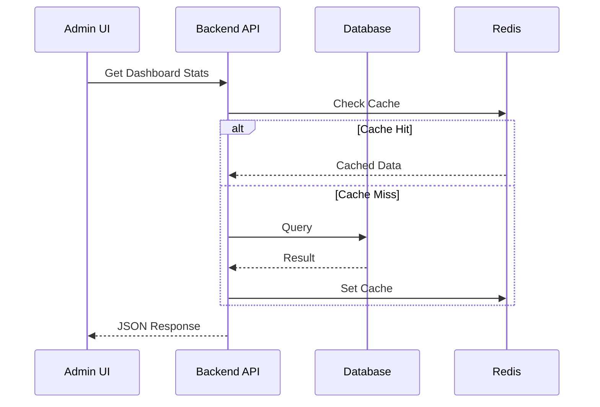

# Admin Architecture Overview

**Status**: 🔄 WIP
**Last Updated**: 2026-01-26

## 📋 Overview

The admin dashboard is a Next.js application using React, shadcn/ui components, and a modular monolith backend. It provides a comprehensive back-office system for managing Sanaeva Store operations.

## 🏗️ System Context

```mermaid
flowchart LR
  U1[Back Office Users\n(Owner/Admin/Staff)] --> BO[Back Office System]
  U2[Customers (Future Storefront)] -.-> SF[Storefront (Future)]
  SF -. API .-> BO

  BO --> PG[(Postgres)]
  BO --> S3[(Object Storage\nImages/Docs)]
  BO --> MQ[(Queue/Event Bus\nOptional)]
  BO --> EXT1[Payment Gateway\n(Future)]
  BO --> EXT2[Shipping Provider\n(Future)]
  BO --> EXT3[Email/SMS/LINE Notify\n(Optional)]

```

```mermaid
flowchart TB
  FE[Back Office Web (Next.js)] --> API[Backend API (Modular Monolith)]
  API --> PG[(Postgres)]
  API --> REDIS[(Redis optional)]
  API --> OBJ[(S3/MinIO - images/docs)]
  API --> WORKER[Background Worker\n(optional)]
  WORKER --> MQ[(Queue optional)]
  WORKER --> PG
```

## 🎯 Technology Stack

### Frontend
- **Framework**: Next.js 16 (App Router)
- **Language**: TypeScript
- **Styling**: Tailwind CSS 4
- **UI Components**: shadcn/ui
- **Charts**: Recharts
- **State**: React Context + Zustand (as needed)
- **Icons**: Lucide React
- **Theme**: next-themes

### Backend
- **Runtime**: Bun
- **Framework**: Elysia
- **Database**: PostgreSQL via Prisma ORM
- **Cache**: Redis (optional)
- **File Storage**: S3 or MinIO
- **Queue**: RabbitMQ/Redis (optional)

## 📂 Frontend Structure

```
app/
├── (admin-dasboard)/
│   ├── layout.tsx          # Admin layout with sidebar/navbar
│   └── admin-dasboard/
│       └── page.tsx        # Dashboard overview
├── admin-dasboard/
│   ├── analytics/          # Analytics pages
│   ├── orders/            # Order management pages
│   ├── products/          # Product management pages
│   ├── customers/         # Customer management pages
│   └── settings/         # Settings pages
└── api/                  # API routes (if needed)
```

### Components Structure

```
components/
├── components-design/       # Feature-specific components
│   ├── admin-sidebar.tsx
│   ├── admin-navbar.tsx
│   └── ...
├── ui/                   # shadcn/ui base components
│   ├── button.tsx
│   ├── card.tsx
│   ├── chart.tsx
│   └── ...
└── lib/                  # Utilities and helpers
    ├── utils.ts
    └── hooks/
```

## 🗄️ Database Design

### Core Tables

- `User` - Admin users and authentication
- `Role` - Role definitions
- `Permission` - Permission definitions
- `UserRole` - User-role assignments
- `Product` - Product catalog
- `ProductVariant` - Product variants
- `Inventory` - Stock levels
- `SalesOrder` - Customer orders
- `OrderItem` - Order line items
- `Customer` - Customer information
- `SalesTransaction` - Payment transactions

## 🔒 Security Model

### Authentication
- JWT-based authentication
- Session management via better-auth
- Multi-factor authentication (future)

### Authorization
- Role-based access control (RBAC)
- Granular permissions per module
- Route guards for protected pages

### Audit Trail
- Log all admin actions
- Timestamp and user tracking
- Change history for critical operations

## 📊 Data Flow



## 🎨 Design System

### Color Palette
- Primary: `hsl(var(--primary))`
- Primary-600: `hsl(var(--primary-600))`
- Success: Green variants
- Warning: Orange variants
- Error: Red variants

### Typography
- Headings: Inter/Geist Sans
- Body: Inter/Geist Sans
- Code: Geist Mono

### Spacing Scale
- 4px base unit
- Multiples: 4, 8, 12, 16, 20, 24, 32, 40, 48, 64

## 🚀 Performance Optimization

### Frontend
- Code splitting via Next.js dynamic imports
- Image optimization via Next Image
- Lazy loading for heavy components
- Memoization for expensive calculations

### Backend
- Database query optimization
- Redis caching for frequent queries
- Connection pooling
- Background jobs for heavy tasks

## 📱 Responsive Strategy

### Breakpoints
- Mobile: < 768px
- Tablet: 768px - 1024px
- Desktop: > 1024px

### Mobile-First Approach
1. Design for mobile first
2. Progressive enhancement for larger screens
3. Touch-friendly interactions
4. Collapsible sidebar for small screens

## 🔌 API Architecture

### RESTful Endpoints
- `/api/admin/auth/*` - Authentication
- `/api/admin/dashboard/*` - Dashboard data
- `/api/admin/orders/*` - Order management
- `/api/admin/products/*` - Product management
- `/api/admin/customers/*` - Customer management

### Response Format
```typescript
interface ApiResponse<T> {
  success: boolean
  data?: T
  error?: {
    code: string
    message: string
  }
  meta?: {
    total?: number
    page?: number
    limit?: number
  }
}
```

## 📝 Monitoring & Logging

### Metrics
- Page load times
- API response times
- Error rates
- User engagement

### Logging
- Application errors
- Admin actions
- Security events
- Performance warnings

## 📖 Related Documentation

- [Order Flow](./order-flow.md)
- [Data Model](./data-model.md)
- [API Routes](./api-routes.md)
- [Backend Structure](../../project-structure/BACKEND-STRUCTURE.md)
