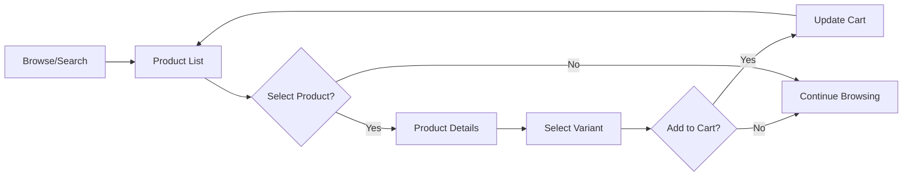

# Product Catalog Specification

**Status**: 📋 PLANNED
**Priority**: High
**Last Updated**: 2026-01-26

## 📋 Overview

The product catalog enables customers to browse, discover, and search for products. It provides intuitive filtering, sorting, and display of product information with images, prices, and variants.

## 🎯 Goals

- Easy product discovery and browsing
- Fast and responsive product listing
- Intuitive search and filtering
- Comprehensive product information display

## 📐 Requirements

### Functional Requirements

1. **FR-1**: Product Listing
   - Grid/list view options
   - Pagination or infinite scroll
   - Product cards with key info
   - Acceptance criteria: 24 products per page by default
   - Priority: High

2. **FR-2**: Product Details
   - Full product information
   - Image gallery
   - Variant selection
   - Stock availability
   - Add to cart
   - Acceptance criteria: All product info clearly displayed
   - Priority: High

3. **FR-3**: Search
   - Full-text search
   - Autocomplete suggestions
   - Search history
   - Acceptance criteria: Search returns results in < 500ms
   - Priority: High

4. **FR-4**: Filtering & Sorting
   - Category filter
   - Price range filter
   - In stock filter
   - Sort by: relevance, price, newest
   - Acceptance criteria: Filters work together
   - Priority: High

## 🔄 User Flow

## 🏗️ Technical Design

### UI Components

- `ProductGrid` - Container for product cards
- `ProductCard` - Single product display
- `ProductDetails` - Full product page
- `ProductGallery` - Image carousel
- `VariantSelector` - Variant choice
- `SearchBar` - Search input with autocomplete
- `FilterPanel` - Sidebar/modal filters
- `SortDropdown` - Sorting options

### API Endpoints

| Method | Endpoint | Description | Auth |
|--------|-----------|-------------|-------|
| GET | `/api/products` | List products with filters | ❌ |
| GET | `/api/products/:id` | Get product details | ❌ |
| GET | `/api/products/search` | Search products | ❌ |
| GET | `/api/categories` | Get categories | ❌ |
| GET | `/api/variants/:id` | Get variant details | ❌ |

## ✅ Acceptance Criteria

- [ ] AC-1: Products display in grid/list
- [ ] AC-2: Product details show all info
- [ ] AC-3: Search works with autocomplete
- [ ] AC-4: Filters and sorting work correctly
- [ ] AC-5: Mobile responsive design

## 📖 Related Documentation

- [Storefront Overview](../README.md)
- [Shopping Cart](./shopping-cart.md)
- [Search](./search.md)
