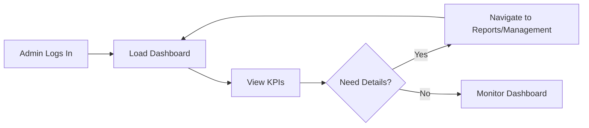

# Dashboard Overview

**Status**: ✅ DONE
**Priority**: High
**Last Updated**: 2026-01-26

## 📋 Overview

The admin dashboard provides a centralized overview of key business metrics, including revenue, orders, customers, and real-time activity. It serves as the primary landing page for admins to quickly assess business health and access detailed reports.

## 🎯 Goals

- ✅ Provide real-time visibility into key performance indicators (KPIs)
- ✅ Enable quick navigation to detailed reports and management sections
- ✅ Present data in visually appealing, easy-to-digest formats
- ✅ Support mobile-first responsive design

## 📐 Requirements

### Functional Requirements

1. **FR-1**: Display Key Performance Indicators
   - Total Revenue with month-over-month growth
   - Total Orders with growth rate
   - Total Customers with growth rate
   - Active Users (real-time count)
   - Acceptance criteria: All metrics update in real-time or near real-time
   - Priority: High

2. **FR-2**: Revenue Overview Chart
   - Desktop vs Mobile traffic comparison
   - Monthly or weekly time series data
   - Interactive tooltips showing exact values
   - Acceptance criteria: Chart shows 6 months of data, sorted by volume
   - Priority: High

3. **FR-3**: Recent Orders Summary
   - Total orders count
   - Growth rate percentage
   - Average order value
   - Fulfillment rate
   - Acceptance criteria: All statistics derived from actual order data
   - Priority: Medium

4. **FR-4**: Sales by Category Chart
   - Bar chart showing sales distribution
   - Categories: Electronics, Clothing, Food, Others
   - Sorted by sales volume (highest to lowest)
   - Acceptance criteria: Chart uses brand primary colors
   - Priority: Medium

### Non-Functional Requirements

1. **Performance**: Dashboard should load in < 2 seconds
2. **Responsiveness**: Must work seamlessly on mobile (320px+) and desktop
3. **Accessibility**: WCAG 2.1 AA compliant
4. **Visual Consistency**: All charts use brand primary colors

## 🔄 User Flow



## 🏗️ Technical Design

### API Endpoints

| Method | Endpoint | Description | Auth |
|--------|-----------|-------------|-------|
| GET | `/api/admin/dashboard/stats` | Get KPI metrics | ✅ |
| GET | `/api/admin/dashboard/revenue` | Get revenue data for chart | ✅ |
| GET | `/api/admin/dashboard/categories` | Get sales by category | ✅ |
| GET | `/api/admin/dashboard/orders-summary` | Get order statistics | ✅ |

### Data Models

```typescript
interface DashboardStats {
  totalRevenue: number
  revenueGrowth: number
  totalOrders: number
  orderGrowth: number
  totalCustomers: number
  customerGrowth: number
  activeNow: number
}

interface RevenueData {
  month: string
  desktop: number
  mobile: number
}

interface CategorySales {
  category: string
  value: number
}
```

### UI Components

- `DashboardPage` - Main container
- `KPICard` - Reusable KPI display with trend indicator
- `RevenueChart` - Revenue overview bar chart
- `OrdersSummary` - Order statistics panel
- `CategoryChart` - Sales by category bar chart

## 📊 Chart Configuration

### Revenue Overview
- Chart Type: Bar Chart
- Data Series: Desktop, Mobile
- Colors: `hsl(var(--primary))`, `hsl(var(--primary-600))`
- Sorting: Descending by total traffic

### Sales by Category
- Chart Type: Bar Chart
- Data Series: Sales value
- Colors: `hsl(var(--primary))`
- Sorting: Descending by sales value

## 🧪 Testing

### Unit Tests

- [x] KPI cards render correctly with data
- [x] Charts receive correct data props
- [x] Charts sort data properly
- [x] Theme toggle functionality

### Integration Tests

- [x] Dashboard fetches and displays API data
- [x] KPI metrics update on refresh
- [x] Charts render with correct dimensions

### E2E Tests

- [ ] User can view dashboard
- [ ] Charts respond to window resize
- [ ] Theme toggle persists across pages

## ✅ Acceptance Criteria

- [x] AC-1: Dashboard loads with all KPI cards
- [x] AC-2: Revenue chart shows desktop vs mobile data
- [x] AC-3: Charts use brand primary colors
- [x] AC-4: Charts sort data from largest to smallest
- [x] AC-5: Layout is responsive (mobile-first)
- [x] AC-6: Dark mode toggle works

## 📚 Implementation Notes

### Completed Features

1. **Collapsible Sidebar**
   - Icon-only view when collapsed
   - Tooltip shows on hover
   - Mobile sheet overlay

2. **Modern Navbar**
   - Glassmorphism backdrop effect
   - Search bar with focus states
   - Notification badge
   - Theme toggle (Sun/Moon)
   - Enhanced user menu

3. **KPI Cards**
   - Subtle gradient glow effect
   - Icons with primary color backgrounds
   - Green text for positive growth
   - Dark mode support

4. **Charts**
   - Using Recharts library
   - Brand primary colors
   - Sorted descending by value
   - Responsive sizing

### Technical Decisions

- Chart library: Recharts (already in project)
- Icons: Lucide React (consistent with existing)
- Styling: Tailwind CSS + shadcn/ui components
- Theme: next-themes for dark mode persistence

## 📖 Related Documentation

- [Admin Architecture](../architecture/overview.md)
- [Order Management](./orders.md)
- [Analytics](./analytics.md)
- [UI Components](../../components/ui/)
