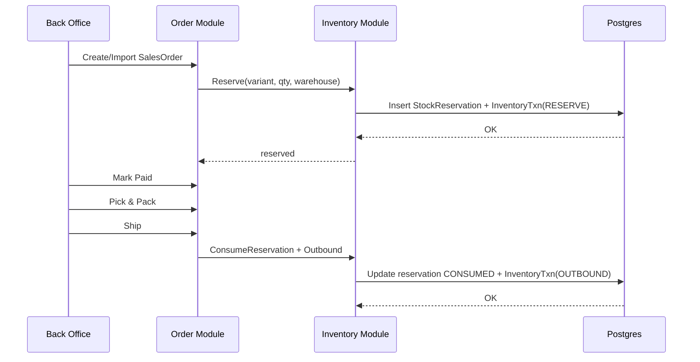

```mermaid
sequenceDiagram
  participant BO as Back Office
  participant ORD as Order Module
  participant INV as Inventory Module
  participant PG as Postgres

  BO->>ORD: Create/Import SalesOrder
  ORD->>INV: Reserve(variant, qty, warehouse)
  INV->>PG: Insert StockReservation + InventoryTxn(RESERVE)
  PG-->>INV: OK
  INV-->>ORD: reserved

  BO->>ORD: Mark Paid
  BO->>ORD: Pick & Pack
  BO->>ORD: Ship
  ORD->>INV: ConsumeReservation + Outbound
  INV->>PG: Update reservation CONSUMED + InventoryTxn(OUTBOUND)
  PG-->>INV: OK
```