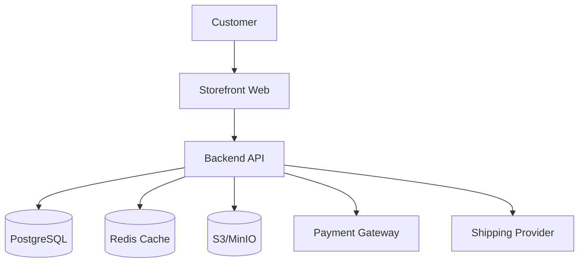

# Storefront Architecture Overview

**Status**: 📋 PLANNED
**Priority**: High
**Last Updated**: 2026-01-26

## 📋 Overview

The storefront is a Next.js application optimized for performance, SEO, and conversion. It shares the backend API with the admin dashboard but focuses on customer experience and e-commerce functionality.

## 🏗️ System Context



## 🎯 Technology Stack

### Frontend
- **Framework**: Next.js 16 (App Router)
- **Language**: TypeScript
- **Styling**: Tailwind CSS 4
- **UI Components**: shadcn/ui
- **State Management**: Zustand/React Context
- **Forms**: React Hook Form + Zod
- **Icons**: Lucide React
- **Theme**: next-themes

### Performance
- **Image Optimization**: Next Image
- **Font Optimization**: next/font
- **Bundle Splitting**: Automatic via Next.js
- **Caching**: Redis for product data, SWR for client state

## 📂 Frontend Structure

```
app/
├── (storefront)/
│   ├── layout.tsx          # Storefront layout (header, footer)
│   ├── page.tsx            # Homepage
│   ├── products/
│   │   ├── page.tsx        # Product listing
│   │   └── [slug]/
│   │       └── page.tsx    # Product details
│   ├── cart/
│   │   └── page.tsx        # Shopping cart
│   ├── checkout/
│   │   └── page.tsx        # Checkout flow
│   ├── account/
│   │   ├── page.tsx        # Account dashboard
│   │   ├── orders/
│   │   └── settings/
│   └── api/                  # Client-side API routes
```

### Components Structure

```
components/
├── storefront/              # Storefront-specific components
│   ├── product-card.tsx
│   ├── add-to-cart.tsx
│   ├── product-gallery.tsx
│   └── ...
└── lib/
    ├── cart-store.ts       # Cart state management
    └── hooks/
        └── use-cart.ts
```

## 🎨 Design System

### Responsive Strategy
- **Mobile**: 320px - 767px (primary target)
- **Tablet**: 768px - 1023px
- **Desktop**: 1024px+

### Mobile-First Principles
1. Touch-friendly interactions (44px minimum tap targets)
2. Simplified navigation on small screens
3. Collapsible/mega menus
4. Full-screen modals on mobile
5. Bottom navigation for key actions

### Performance Targets
- **FCP (First Contentful Paint)**: < 1.5s
- **LCP (Largest Contentful Paint)**: < 2.5s
- **TTI (Time to Interactive)**: < 3.5s
- **CLS (Cumulative Layout Shift)**: < 0.1

## 📊 State Management

### Client State
- **Cart**: Zustand store, persisted to localStorage
- **User**: React Context from auth
- **Theme**: next-themes
- **Products**: SWR for caching

### Server State
- **API Caching**: Redis with 15-min TTL
- **ISR (Incremental Static Regeneration)**: Product pages
- **CDN**: Static assets and images

## 🔌 API Integration

### Public Endpoints
- `/api/products` - Product listing and search
- `/api/products/:id` - Product details
- `/api/categories` - Category tree
- `/api/cart` - Cart operations
- `/api/checkout` - Checkout process

### Auth Required Endpoints
- `/api/account` - Account management
- `/api/orders` - Order history
- `/api/wishlist` - Wishlist (future)

## 🔒 Security Considerations

### Client-Side
- XSS prevention via React
- CSRF tokens for mutations
- Rate limiting on checkout
- Input validation via Zod

### Payment Security
- PCI DSS compliance via payment gateway
- No card data stored locally
- Secure payment forms (iframe or hosted)

## 📱 SEO Strategy

### Meta Tags
- Dynamic meta tags per page
- Open Graph tags for social sharing
- Twitter Card tags
- Structured data (JSON-LD) for products

### Technical SEO
- Clean URLs (`/products/slug`)
- Proper HTTP status codes
- Canonical URLs
- Sitemap.xml generation
- Robots.txt

## ✅ Acceptance Criteria

- [ ] AC-1: Storefront loads in < 3 seconds
- [ ] AC-2: Fully responsive on all devices
- [ ] AC-3: SEO optimized for search engines
- [ ] AC-4: Cart state persists across sessions
- [ ] AC-5: Payment flow is secure and PCI compliant

## 📝 Implementation Notes

### Current Status
- ✅ Frontend stack defined
- ⏳ Storefront layout not created
- ⏳ Product catalog not implemented
- ⏳ Shopping cart not implemented
- ⏳ Checkout flow not implemented

### Technical Decisions
- Client-side routing via Next.js
- Server-side rendering for SEO
- ISR for product pages (performance)
- Zustand for cart (simplicity)

### Future Enhancements
- Progressive Web App (PWA)
- Offline functionality
- Push notifications
- AR product viewing

## 📖 Related Documentation

- [Frontend Structure](../../../docs/project-structure/FRONTEND-STRUCTURE.md)
- [Product Catalog](../features/product-catalog.md)
- [Shopping Cart](../features/shopping-cart.md)
- [Checkout](../features/checkout.md)
